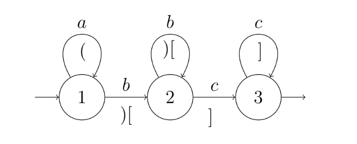
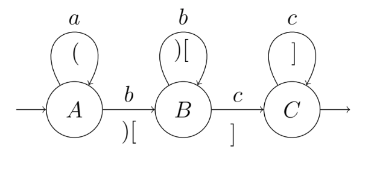
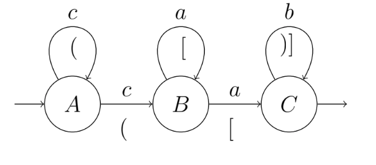
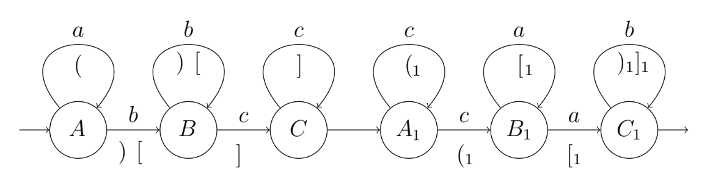
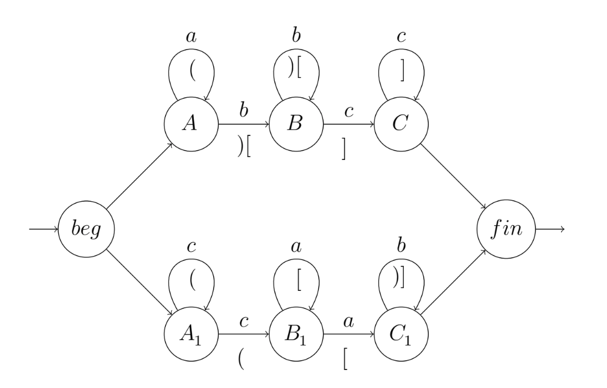

# lgraph
Python module for working with L-graphs.

## Installation
```sh
pip install l-graph
```

## Creating an L-graph
```python
from lgraph import LGraph

lg = LGraph(3)

lg.add_edge(lg.initial_main.name, '1')
lg.add_edge('1', '2', label='b', round_trace=')', square_trace='[')
lg.add_edge('2', '3', label='c', square_trace=']')
lg.add_edge('3', lg.final_main.name)

lg.add_edge('1', '1', label='a', round_trace='(')
lg.add_edge('2', '2', label='b', round_trace=')', square_trace='[')
lg.add_edge('3', '3', label='c', square_trace=']')

```


## Saving and loading L-graphs
```python
lg.save('graph_examples/a^n_b^n_c^n')
lg.load('graph_examples/a^n_b^n')
```

## Cheking if string is in the language of the L-graph
```python
lg = LGraph()
lg.load('graph_examples/a^n_b^n_c^n')

'abc' in lg
>>> True

'abccc' in lg
>>> False

# Finding path of the string
path = lg.find_successful_path('abc')
LGraph.path_to_string(path)
>>> initial_main---->1--a-->1--b-->2--c-->3---->final_main

```

## Type definition of the L-graph
L-graph types defined in LGraph.LGraphType 
```python
class LGraphType(Enum):
    RECURSIVELY_ENUMERABLE = 0
    CONTEXT_SENSITIVE = 1
    CONTEXT_FREE = 2
    REGULAR = 3
```
To define type of the L-graph use:
```python
lg.type
```
To check properties of L-graph use:
```python
lg.is_regular()
lg.is_context_free()
lg.is_context_sensitive()
```

## Opeartions
Left:


Right:


```python
lg_left, lg_right = LGraph(), LGraph()

lg_left.load('graph_examples/left')
lg_right.load('graph_examples/right')
```

### Concatenation
```
lg = lg_left * lg_right
lg.save('graph_examples/concatenate_result')
```


### Union
```python
lg = lg_left + lg_right
lg.save('graph_examples/union_result')
```


Shorter version is also available:
```python
lg_left *= lg_right
lg_left += lg_right
``` 